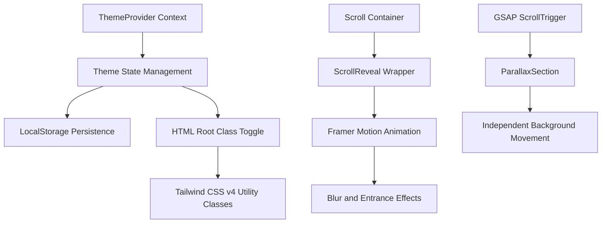

# Smart Traffic and Road Safety Dashboard

A professional, high-end dashboard for urban mobility management and road safety monitoring. This application features a comprehensive theme system and advanced scroll-triggered animations to provide a premium user experience.

## System Architecture

The following diagram illustrates the integration of the theme management and animation systems.

## Core Features

| Feature | Technical Description | Implementation |
|---------|----------------------|----------------|
| Global Theme System | Dynamic light and dark mode switching with persistent user preference. | React Context API, LocalStorage, and documentElement class manipulation. |
| Scroll Entrance Animations | Blurry and smooth entrance effects for UI components as they enter the viewport. | Framer Motion integration with useInView hooks. |
| Parallax Sections | Multi-layered depth effects driven by scroll position for background decorations. | GSAP ScrollTrigger orchestration. |
| Traffic Monitoring | Real-time map visualization and traffic density analytics. | React Leaflet and Tailwind CSS v4 styling. |
| Emergency Management | Dedicated center for emergency dispatch and incident tracking. | Modular route suggestion and emergency contact system. |

## Technical Implementation Details

### Design Language
The project utilizes a glassmorphism design language, characterized by background blurs, subtle borders, and harmonious color palettes. The transition between light and dark modes is handled globally via CSS variables and Tailwind dark mode variants.

### Animation Strategy
1. Entrance Reveals: Components use the ScrollReveal wrapper to animate opacity, scale, and blur-radius upon entering the viewport.
2. Background Parallax: Strategic decorative elements use GSAP to move at different speeds relative to the scroll, creating an illusion of depth.
3. Hover Interactions: Interactive elements include micro-animations for feedback, enhancing the tactile feel of the interface.

## Project Structure

- src/utils/ThemeProvider.jsx: Centralized theme logic.
- src/components/ScrollReveal.jsx: Standardized entrance animation component.
- src/components/ParallaxSection.jsx: Advanced parallax wrapper.
- src/index.css: Root styles and Tailwind v4 configuration.
